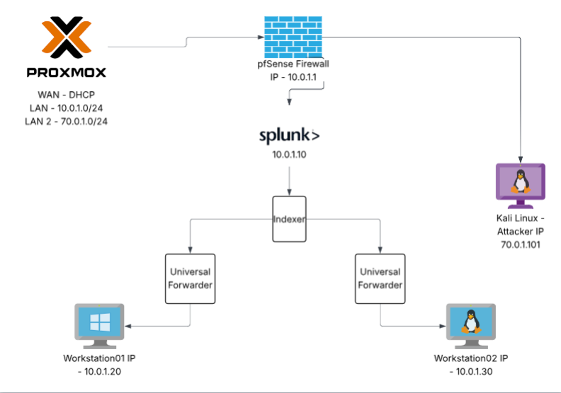

# Educational SOC Lab (Splunk + pfSense + Windows + Ubuntu)

## Educational Context
This lab was developed to support my postgraduate cybersecurity studies and hands-on SOC learning. It focuses on SIEM operations, incident response, and integrating multiple security tools to simulate real-world attack and defence scenarios.

This repo contains configuration files and screenshots from my educational SOC lab.
The lab collects endpoint logs via Splunk Universal Forwarders and visualises detections in Splunk.

## Topology
- pfSense Firewall: 10.0.1.1
- Splunk SIEM (Ubuntu): 10.0.1.10
- Windows Workstation01: 10.0.1.20 (Sysmon + UF)
- Ubuntu Workstation02: 10.0.1.30 (UF)
- Kali Attacker (LAN 2): 70.0.1.101

## Reflection

This project improved my understanding of SOC workflows, log correlation, and alert investigation. It reinforced the importance of documentation, structured monitoring, and understanding attacker behavior from a defensive perspective.
